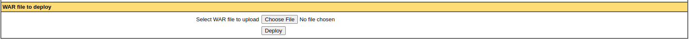

# Stenden Dashboard
This is the stenden dashboard an API created for the use within NHL Stenden.

* [Raspberry Setup](https://github.com/StendenDashboard/api#raspberry-setup)
* [Intellij Setup](https://github.com/StendenDashboard/api#intellij-setup)

## Raspberry Setup

## 1. Server Configuration
First we need to set up everything in the hosting environment. We recommend you use linux. In the example we are using 'DebianGNU/Linux 10(buster)' running in a virtual machine.

## 1.1 Updates

Before starting anything run a check for any updates.
```shell
sudo apt update
```

## 1.2 Tomcat
Tomcat is a webserver for running WAR files. (Web Application Runtimes).

### 1.2.1 Installing Java
So first we check if Java is installed. Run this command:
```shell
sudo apt install default-jdk
```

### 1.2.2 Check for Tomcat in Repository
Check for the Tomcat server package in the repository. This will show you all the latest packages available for download.
```shell
sudo apt-cache search tomcat
```

### 1.2.3 Download Tomcat
Download the tomcat9 package and the tomcat9 admin package and its dependencies with the following terminal command.
```shell
sudo apt install tomcat9 tomcat9-admin
```

### 1.2.4 Verify the install
When the download is finished, it will install the Apache Tomcat Server, which will start up automatically.
For verification, type the following ss command, which will show you the 8080 open port number, the default open port reserved for Apache Tomcat Server.
```shell
ss -ltn
```


### 1.2.5 Test Tomcat Server
Now, you may test your Tomcat server. When Tomcat starts running, you can test the program in a web browser. 
Using the system’s loopback address, you can connect to the Tomcat server by specifying the port with the address in the URL search bar, as follows:
```shell
http://127.0.0.1:8080
```
Tomcat is up and running if you see this page, "it works!".


### 1.2.6 Create User
You should create a user for the Web Application Manager in the Tomcat Server. A new user account must be set up to use the Apache Tomcat Web Application Manager.

Open the tomcat-users.xml file in the Tomcat directory with your favorite text editor.
```shell
sudo nano /etc/tomcat9/tomcat-users.xml
```

### 1.2.7 Add Tagged Lines
When the file is opened, add these three tagged lines in the file above the “<” tag. Here, new user with the name “tomcat” has been created with a password set as “pass.” Add your own values as substitution for the username and password.
```shell
<role rolename="admin-gui"/>
<role rolename="manager-gui"/>
<user username="tomcat" password="password" roles="admin-gui,manager-gui"/>
```

Save the file and close it. Now, we can move on to accessing the manager application area.

### 1.2.8 Restart Tomcat
Restart the Tomcat Server with the following command. This won't output anything, but it should have restarted.

```shell
sudo systemctl restart tomcat9
```

### 1.2.9 Access Tomcat Application Manager

In order to access the Tomcat server web application manager, enter the URL:  http://127.0.0.1:8080/manager/html
into the web browser URL search bar and press enter. Next, enter the credentials that you gave to the new user in Tomcat Server. 
You should now see the Web Application Manager Window.


## 1.3 MySQL

### 1.3.1 Installing MySql

For our database we will be using MySQL which we can install using the following command.
```shell
sudo apt-get install mariadb-server
```

### 1.3.2 Check MySQL
Once the installation is complete, the MySQL server should be started automatically.
You can quickly check its current status via this command:
```shell
sudo service mysql status
```


### 1.3.3 Login with root

First time with MySQL you will need to login with ```sudo mysql -u root``` as the root user this should sign you in directly.


### 1.3.4 Create new user
Create a new user using the following command. (If different credentials are wanted then this has to be changed in the code)
```shell
CREATE USER 'stenden'@'localhost' IDENTIFIED BY 'St3nd3n_D@shboard';
```


### 1.3.5 Grant new user permissions

At this point stenden has no permissions to do anything with the databases. In fact, even if stenden tries to login (with the password, St3nd3n_D@shboard), they will not be able to reach the MySQL shell.

Therefore, the first thing to do is to provide the user with access to the information they will need.

```shell
GRANT ALL PRIVILEGES ON stenden_dashboard.* TO 'stenden'@'localhost';
```

### 1.3.6 Flush
Once you have finalized the permissions that you want to set up for your new users, always be sure to reload all the privileges.
```shell
FLUSH PRIVILEGES;
```
Your changes will now be in effect.

### 1.3.7 Quit and Log In
To test our new user, log out by typing:
```shell
quit
```
And log back in, using the password from earlier, with this command:
```shell
mysql -u stenden -p
```


### 1.3.8 Create Database
Run the command ```CREATE DATABASE stenden_dashboard;``` to create the stenden_dashboard database.

## 1.4 Deploy application

### 1.4.1 Download the .WAR
First we will download the .WAR file using the following command. Make sure you are not writing within the MySQL/MardiaDB commandline type ```quit``` if you are.

```shell
wget https://github.com/RubenKuilder/AdvancedJavaEindopdracht/raw/main/additional_resources/Stenden_Dashboard.war
```

### 1.4.2 Deploying the application
Go to http://127.0.0.1:8080/manager/html and look under the deploy tab for "WAR file to deploy". 
Click on Choose File and choose the file we just downloaded. Then hit deploy.



### 1.4.3 Checking if the application deployed
After the page finishes loading you should see it have true under the running header, it should have started up automatically.
If it did not launch try hitting deploy on Stenden_Dashboard, if it errors you can look under ```/var/lib/tomcat9/logs/catalina.out``` for the logs.


---------------------

## Intellij Setup
In this part of the tutorial we will be explaining how to setup the API within intellij.
For the purposes of keeping this installation simple we are going to assume you have Intellij installed if not refer to their website for more information and guidance on how to install it.

### 2.1 Cloning the repository
First you must clone or download the repository, you can save the code wherever you would like we suggest you put it in an empty folder to not create unforeseen problems.

### 2.2 Install Tomcat9
We use [Tomcat 9.0.56](https://tomcat.apache.org/download-90.cgi) as a means of running the API, it is required for running the API.

### 2.3 make Application.properties
To make sure the application runs correctly we must create a new file called ```application.properties```. This file must be placed inside
```src/main/resources``` on the level of ```changelog_master.xml.```

In this file we will define a few key factors to the API.

* **database.username**: This is the login name for Xampp, you can change this to whatever your Xampp uses or create a new user with the credentials we have supplied.
* **database.password**: Same as with the username, change it or make a new user in Xampp.
* **database.url**: The connection string for the database, we use the database stenden_dashboard. Leave this name as is in a later step we will create the database as is needed.
* **secret.key**: Secret key, leave as is.
```properties
database.username=stenden
database.password=St3nd3n_D@shboard
database.url=jdbc:mysql://127.0.0.1:3306/stenden_dashboard
secret.key=secret
```

### 2.4 Creating the database
We will create a database by using Xampp. Execute the following query inside ```localhost/phpmyadmin```.

```mysql
CREATE DATABASE stenden_dashboard;
```

### 2.5 Running the API
First open the project and build the application to ensure no errors are encountered.

Next navigate to the run anything window and execute
```mvn clean verify cargo:run```

After a few minutes of startup messages it should be running, and you can navigate to the application under the normal ```localhost:8080```

### 2.6 Running tests with coverage (_optional?_)
This part is optional unless it's not, I will explain. Running test with coverage for some of the team had an issue involving the coverage reporter.
The default Idea coverage reporter would not function with dependency injection so every single test would break, to fix this we had to switch the coverage reporter to a different one which then made the tests work.

If running tests with coverage breaks all tests this can be fixed by going to 

```
run -> 
edit configurations -> 
All in AdvancedJavaEindopdracht -> 
Modify options -> 
Specify alternative code coverage runner -> 
Here you choose a different runner
```

For me personally I used JaCoCo because it was the only other runner available to me.